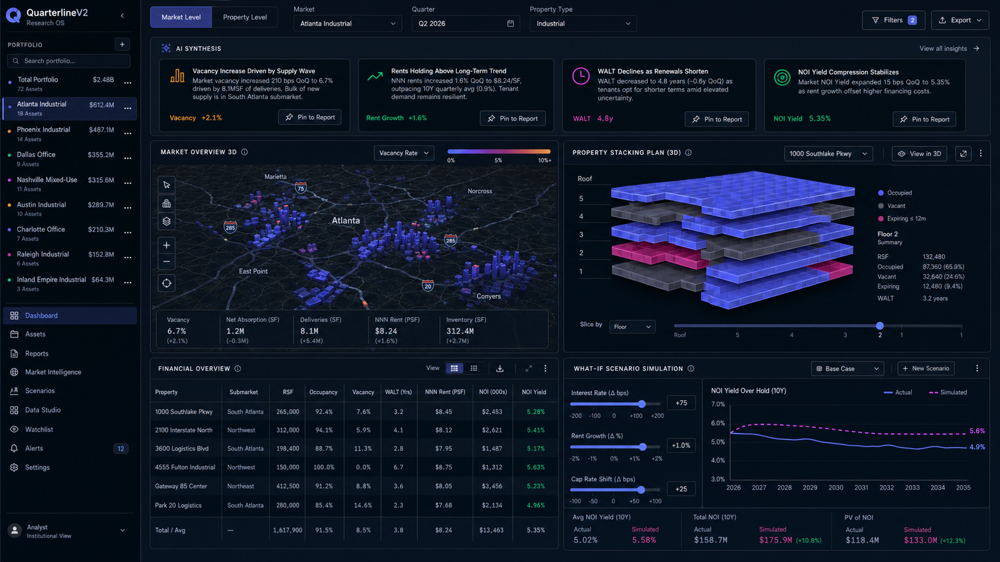

# QuarterlineV2 Design Goals

Date: 2026-05-09

## Source Artwork

Design target:

Path:

- `docs/design/quarterline-v2-industrial-minimalism-concept.png`

This image is a design goal for the future desktop app. It is not implemented
software and should not be represented as a current product screenshot.

## Original Design Specification

The concept artwork was generated from the design specification at:

- `docs/design/technical-design-specification.md`

That document defines the exact color tokens, typography scale, layout
architecture ("The Bento Grid"), 3D stacking plan color-coding, what-if
simulation controls, AI narrative layer, and report generation workflow that
the artwork represents. Use it as the source of truth for design-system
implementation.

## 3D Implementation Reference

For the finished-product 3D modules (market map and stacking plan), a Three.js
skills repository is available at:

- https://github.com/CloudAI-X/threejs-skills

Relevant skills: fundamentals, geometry, materials, interaction, lighting.
See project memory for details on which skills apply to which modules.

## Core Concept

QuarterlineV2 should feel like an institutional desktop research terminal for
commercial real estate analysis. The desired mood is industrial minimalism:
precise, dense, dark, calm, and engineered for sustained analyst work.

## Desktop App Goals

- Downloadable desktop app, not a hosted browser product.
- Native-window feel with persistent workspace chrome.
- Local-first research workflow with optional governed hosted services later.
- Fast switching between portfolio, assets, market intelligence, reports,
  scenarios, data studio, watchlist, alerts, and settings.
- High-density controls sized for laptop and desktop analyst work.
- Stable panel dimensions that prevent layout shift while analysts filter,
  pin, simulate, and review.

## Visual Language

- Primary background: deep charcoal or midnight navy.
- Surfaces: dark slate panels with subtle 1px slate borders.
- Active/action color: electric indigo.
- Anomaly/alert colors: burnt orange and deep magenta.
- Positive trend color: emerald.
- Secondary text: cool slate.
- Radius: 8px for panels and controls.
- Typography: compact sans-serif interface, with monospaced tabular numerals for
  financial data, percentages, RSF, NOI, yield, and scenario outputs.

## Layout Target

- Persistent left portfolio navigation at roughly 20% width.
- Main workspace at roughly 80% width.
- Compact top filter bar with Market Level / Property Level, market, quarter,
  and property type.
- Top tier: AI synthesis insight cards with plain-language market narratives
  and `Pin to Report` actions.
- Middle tier: 3D market overview and 3D property stacking plan.
- Bottom tier: financial table and what-if scenario simulation.

## Required Product Modules

- Portfolio list with asset counts and value summaries.
- Global research filters.
- AI synthesis cards that translate complex data changes into analyst-readable
  language.
- 3D geospatial market overview with market metrics.
- 3D stacking plan sliced by floor and colored by occupancy state.
- Financial overview table with sticky-header behavior in implementation.
- What-if simulation controls for interest rate, rent growth, and cap rate
  shifts.
- Actual vs. simulated scenario curve.
- Pin-to-report affordance on analysis modules.

## Interaction Goals

- Analysts can pin any module into a report assembly queue.
- Filters persist globally across market-level and property-level views.
- Scenario sliders update curves and downstream financial summaries.
- Stacking-plan hover or selection reveals WALT, RSF, occupied/vacant/expiring
  status, and lease timing.
- Tables preserve numeric alignment and remain readable under dense conditions.

## Design Non-Goals

- No marketing landing page.
- No oversized hero typography.
- No generic SaaS card grid.
- No pale beige, cream, or soft lifestyle palette.
- No decorative blobs, orbs, or stock imagery.
- No fake browser-hosted positioning; this should read as serious desktop
  analysis software.

## Visualization Targets

### Finished Product: 3D Interactive Modules

The finished product should include:

- **3D Market Overview Map**: interactive 3D geospatial visualization with
  extruded building footprints or submarket volumes, color-coded by metrics
  (vacancy, absorption, asking rent). Built with deck.gl or Three.js.
  Supports rotation, zoom, hover for details, and click to drill into
  submarket or property views.
- **3D Property Stacking Plan**: interactive 3D building cross-section showing
  floors as stacked layers, colored by occupancy state (occupied, vacant,
  expiring). Hover reveals WALT, RSF, tenant, lease timing per suite. Click
  to drill into floor or suite details.

### MVP: 2D Placeholders

The MVP will use simplified 2D versions of both modules:

- **2D Market Map**: flat Mapbox or similar map with submarket boundary
  polygons, color-coded by a selected metric. Click submarket for details.
- **2D Stacking Plan**: floor grid or table showing floors as rows, suites as
  cells, colored by occupancy state. Same data contract as the future 3D
  module.

The 2D modules should occupy the same layout regions and accept the same data
inputs as their 3D replacements, so the transition is a rendering swap, not a
structural change.

## Implementation Notes For Future Phase

Desktop runtime: Electron (decided 2026-05-09, see `docs/decision-log.md`).
Windows-first packaging. The implementation should start from the approved
architecture in `docs/architecture.md`, not from V1 code.
